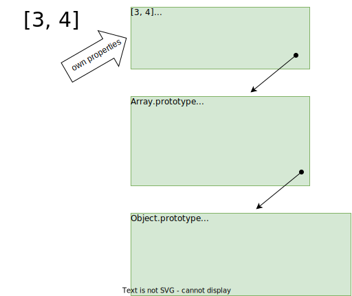

# Object & Function

## Object properties

### Property creation

```javascript
{
    const literal = { foo: 'bar' }
    console.log(literal)

    const byAssigning = {}
    byAssigning.foo = 'bar'
    console.log(byAssigning)
    
    const gettersAndSetters = {
        get foo() {
            console.log('getter', this.value)
            return this.value
        },
        set foo(newValue) {
            console.log('setter', newValue)
            this.value = newValue
        }
    }
    console.log(gettersAndSetters)
    
    function ConstructorFunction() {
        this.foo = 'bar'
    }
    const inConstructor = new ConstructorFunction()
    console.log(inConstructor)

    class Class {
        foo = 'bar'

        constructor() {
            this.foo2 = 'bar2'
        }
    }
    const classProperty = new Class()
    console.log(classProperty)

    const objectCreate = Object.create(Object.prototype, {
        foo: {
            value: 'bar'
        }
    })
    console.log(objectCreate)

    const objectDefineProperty = {}
    // also Object.defineProperties()
    Object.defineProperty(objectDefineProperty, 'foo', {
        value: 'bar'
    })
    console.log(objectDefineProperty)
}
```
  
### Operations on properties

```javascript
const obj = {}

// creation
obj.foo = 'bar'

// read
console.log(obj.foo)
console.log(obj['foo'])

// write
obj.foo = 'baz'

// enumerate
for (const propertyName in obj) {
    console('property name of "obj"', propertyName)
}

// change properties
Object.defineProperty(obj, 'foo', {
    value: 'bazbaz',
    enumerable: false,
    writable: false,
    configurable: true
})

// delete
delete obj.foo
```
  
### Properties of properties

```javascript
globalThis.obj = {}

// same as obj.foo = 'bar'
Object.defineProperty(obj, 'foo', {
    value: 'bar',
    enumerable: true,
    writable: true,
    configurable: true
})

// defaults for creation vs. modification
Object.defineProperty(obj, 'bar', {
    // value: undefined,
    // enumerable: false,
    // writable: false,
    // configurable: false
})

// getters && setters
Object.defineProperty(obj, 'gsFoo', {
    get: function () {
        return this.fooStorage
    },
    set: function (newValue) {
        this.fooStorage = newValue
    },
    enumerable: true,
    configurable: true
})

// not enumerable
Object.defineProperty(obj, 'notEnumerable', {
    value: 'bar',
    enumerable: false,
    writable: true,
    configurable: true
})


// not writable
Object.defineProperty(obj, 'notWritable', {
    value: 'bar',
    enumerable: true,
    writable: false,
    configurable: true
})

/*
 not Configurable, It's forbiddeden to
   * change convert between value and getter & setter
   * delete the property
   * change properties except for `writable` to false
*/
Object.defineProperty(obj, 'notConfigurable', {
    value: 'bar',
    enumerable: true,
    writable: true,
    configurable: false
})

console.log('obj', obj)

// Introspection
console.log('"nonWritable" property descriptor', Object.getOwnPropertyDescriptor(obj, 'notWritable'))
console.log('property descriptors', Object.getOwnPropertyDescriptors(obj))
```
  
<details>
<summary>Task</summary>

Create an object with property `foo` that


* can only be assigned integers. Assignments of other values are ignored.
* can only be read if value % 3 is 0. When value % 3 is 1 it is always read as `"1"`. When
value % 3 is 2, value can't be read - there is no getter.
* is enumerable only when the value is even

</details>

<details>
<summary>Task</summary>

* Write a function that takes an object as a single parameter and return array of
  all non-enumerable keys
  * What is type of the returned value?
  
    <details>
    
    ```
    Array<string | Symbol>
    ```
    
    </details>

</details>

### Protecting object against change

* `Object.preventExtensions()`
  * effects 
    * new properties can't be added
    * prototype can't be reassigned
  * it cannot be undone
  * `Object.isExtensible()`

  ```javascript
  {
      const obj = { foo: 8 }
      obj.bar = 9
      console.log('isExtensible', Object.isExtensible(obj))
      Object.preventExtensions(obj)
      console.log('isExtensible', Object.isExtensible(obj))
      obj.baz = 10 // silently ignored because "strict mode is not on"
      console.log('obj', obj)
  }
  
  (() =>
  {
      'use strict'
      const obj = { foo: 8 }
      obj.bar = 9
      console.log('isExtensible', Object.isExtensible(obj))
      Object.preventExtensions(obj)
      console.log('isExtensible', Object.isExtensible(obj))
      obj.baz = 10 // this throws TypeError
      console.log('obj', obj)
  })()
  ```
    
* `Object.seal()`
  * effects
    * it prevents extension
    * object properties are non-configurable
  * it cannot be undone
  * `Object.isSealed()`
  
  ```javascript
  {
      const obj = { foo: 8 }
      console.log('isSealed', Object.isSealed(obj))
      Object.seal(obj)
      console.log('isSealed', Object.isSealed(obj))
      delete obj.foo 
      console.log('obj', obj)
  }
  
  (() =>
  {
      'use strict'
      const obj = { foo: 8 }
      console.log('isSealed', Object.isSealed(obj))
      Object.seal(obj)
      console.log('isSealed', Object.isSealed(obj))
      delete obj.foo 
      console.log('obj', obj)
  })()
  ```
    
* `Object.freeze()`
  * effects
  * it prevents extension
  * object properties are non-configurable and non-writable
  * it cannot be undone
  * `Object.isFrozen()`
  
  ```javascript
  {
      const obj = { foo: 8 }
      console.log('isFrozen', Object.isFrozen(obj))
      Object.freeze(obj)
      console.log('isFrozen', Object.isFrozen(obj))
      obj.foo = 9
      console.log('obj', obj)
  }
  
  (() =>
  {
      'use strict'
      const obj = { foo: 8 }
      console.log('isFrozen', Object.isFrozen(obj))
      Object.freeze(obj)
      console.log('isFrozen', Object.isFrozen(obj))
      obj.foo = 9
      console.log('obj', obj)
  })()
  ```

<details>
<summary>Task</summary>

Observe protection against change of objects

```javascript
Object
Object.prototype
globalThis.crypto
```
using methods

```javascript
Object.isExtensible()
Object.isSealed()
Object.isFrozen()
Object.getOwnPropertyDescriptors()
```
    
</details>

<details>
<summary>Task</summary>

Task: is frozen object considered not extensible?

<details>

```javascript
Object.isExtensible(Object.freeze({}))
```

</details>

</details>

## Prototype inheritance

* objects can be organized singly linked list like structure. When a property is being accessed, all
  objects in the chain are searched till the property if found (or `undefined` is returned in case
  of read access and property is created in the first list element in case of write access).
* Object linked as the "following one to search for a property" is called **prototype**
* The linked list of objects is called **prototype chain**
* Properties found in object itself (not in other objects down the chain) are called **own**



```javascript
{
    const obj = {
        '0': 'hello',
        '1': 'world',
        'foo': 'bar',
    }
    // get prototype
    Object.getPrototypeOf(obj)
    // also a deprecated way
    obj.__proto__
    
    // set prototype - there should never be a good reason for that, very slow
    Object.setPrototypeOf(obj, Array.prototype)
    
    // using property that is not own
    obj.toString()
    
    // checking for property presence
    '1' in obj
    'toString' in obj

    // creating object with no prototype
    const noProtoObject = Object.create(null, {
        foo: {
            value: 8
        } })

    // creating object with specific prototype
    const childObj = Object.create(obj, {
        foo: {
            value: 8
        },
        hare: {
            value: 'agile animal',
            enumerable: true
        }
    })
    
    // iterating through all enumerable properties
    for (const propertyName in childObj) {
        console.log('property', propertyName, 'isOwn', Object.hasOwn(childObj, propertyName))
    }
    
    // properties shadowing
    
    // new value is store as own
    childObj[0] = 'bye'
    
    // change in prototype, very slow, didscouraged
    delete childObj[0]
}
```

### Own stuff

```javascript
{
    const obj = {
        '0': 'hello',
        '1': 'world',
    }
    Object.defineProperties(obj, {
        'foo': { value: 'bar' },
        [Symbol('symbolKey')]: {
            value: 'symbol value',
            enumerable: true,
            writable: true,
            configurable: true
        }
    })

    console.log('foo property descriptor', Object.getOwnPropertyDescriptor(obj, 'foo'))
    console.log('property descriptors', Object.getOwnPropertyDescriptors(obj))
    console.log('own property names', Object.getOwnPropertyNames(obj))
    console.log('own property symbols', Object.getOwnPropertySymbols(obj))
    console.log('own property symbols of an array prototype',
        Object.getOwnPropertySymbols(Object.getPrototypeOf([3, 4])))
    
    // own enumerabele string-based
    console.log('keys()', Object.keys(obj))
    console.log('values()', Object.values(obj))
    console.log('entries()', Object.entries(obj))


    console.log('hasOwn(\'foo\')', Object.hasOwn(obj, 'foo'))
    console.log('hasOwn(\'toString\')', Object.hasOwn(obj, 'toString'))

    console.log('hasOwnProperty(\'foo\')', obj.hasOwnProperty('foo'))
    console.log('hasOwnProperty(\'toString\')', obj.hasOwnProperty('toString'))

    console.log('obj.hasOwnProperty(\'hasOwnProperty\')',
        obj.hasOwnProperty('hasOwnProperty'))
    console.log('Object.getPrototypeOf(obj).hasOwnProperty(\'hasOwnProperty\')',
        Object.getPrototypeOf(obj).hasOwnProperty('hasOwnProperty'))
    
}
```

<details>
<summary>Task</summary>

Write a function that

* takes an object as an argument
* returns array of arrays of keys (string or Symbol) of the object grouped by prototypes. First
  array contains argument's own properties.

Verify on inputs

```javascript
Object.create(null)
Object.assign(Object.create(null), { foo: 4, bar: 5 })
({ foo: 4, bar: 5 })
Object.assign(Object.create([3, 4]), { foo: 4, bar: 5 })
Object.assign(Object.create([3, 4]), { foo: 4, bar: 5 })
Object.assign(Object.create(Object.create(Object.create([3, 4]))), { foo: 'bar' })
Number(7)
666
```

</details>

<hr>

* creation of object
    * literal
    * `Object.create`
    * `new`
    * `Object.fromEntries()`
    * btw. `Object.assign()`
* object prototype
    * chain
    * own properties, symbols
* `Object.prototype.toString()`
* Function
    * named and anonymous
    * default arguments
    * function, constructor, method
    * `this`
        * outside function
            * global object
        * inside regular function
            * strict mode / modules
            * global object / `undefined`
        * inside method
            * object on which it is called
        * inside constructor
            * new object
            * `new.target === fn`
    * `Function.name`
    * `Function.prototype`
    * `Function.length`
    * `Object.prototype.constructor`
    * `instanceof` operator
        * `Symbol.hasInstance`
    * `bind`, `apply`, `call`
    * creation
        * function literal
        * method definition
        * `Function` constructor
        * local functions

          ```javascript
          function a() {
              console.log(a)
              b()
              console.log(a, window.a, b, window.b)
              function b() {
                  console.log('b')
              }
          }
          a()
          b()  // it fails
          ```

          ```javascript
          function a() {
              console.log('a')
              b()
              let b = 3
              function b() { // SyntaxError: redeclaration of let b
                  console.log
              }
          }
          ```
    * lambdas
        * `this` not bound
    * immediately invoked function